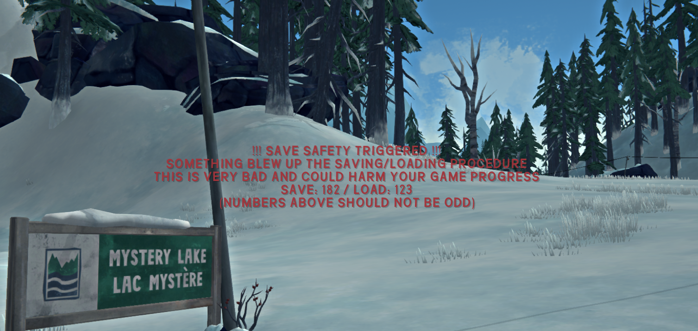

# SaveSafety

When a patch to RestoreGlobalData and SaveGlobalData explode, remaining patches are not executed. This means that your save could be partially corrupted/lost if it's saved afterwards.

When this happens it's likely to be missed because it does not stop the game from loading into a new scene.

This mod explicitly warns you when saving or loading patches are not successfully executed so you know it's time to quit without saving.

